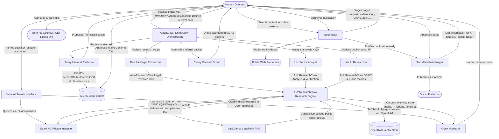
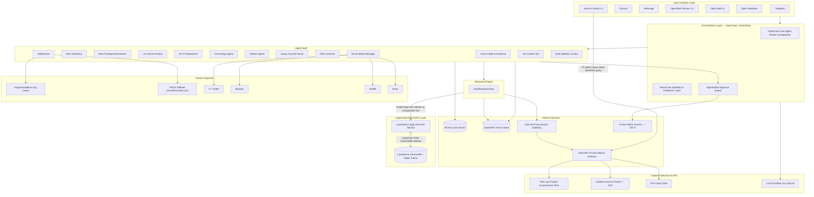

# MISJustice Alliance Firm

> **The MISJustice Alliance AI-agent legal advocacy, research, publishing, and public-engagement platform.**

[](LICENSE)
[](https://github.com/MISJustice-Alliance/misjustice-alliance-firm)
[](https://github.com/NemoGuard/openclaw)

---

## Table of Contents

1. [Project Overview](#1-project-overview)
2. [Platform Mission](#2-platform-mission)
3. [Agent Roles and Capabilities](#3-agent-roles-and-capabilities)
4. [Human-in-the-Loop Governance](#4-human-in-the-loop-governance)
5. [Control Interface Layer](#5-control-interface-layer)
6. [Search and Retrieval Architecture](#6-search-and-retrieval-architecture)
7. [Case Management Backend](#7-case-management-backend)
8. [Example Workflow Diagram](#8-example-workflow-diagram)
9. [System Architecture Diagram](#9-system-architecture-diagram)
10. [Repository Structure](#10-repository-structure)
11. [Getting Started](#11-getting-started)
12. [Security and Privacy Model](#12-security-and-privacy-model)
13. [Project Resources and Links](#13-project-resources-and-links)
14. [Contributing](#14-contributing)
15. [Disclaimer](#15-disclaimer)

---

## 1. Project Overview

**MISJustice Alliance Firm** is a multi-agent AI operating environment designed to support the MISJustice Alliance — an anonymous legal research and advocacy collective focused on constitutional rights, civil rights enforcement, prosecutorial and police misconduct, legal malpractice, and institutional abuse across Montana and Washington State jurisdictions.

This repository defines the architecture, agent role definitions, prompt policies, workflow orchestration, service integrations, and deployment configuration for the MISJustice Alliance AI agent firm. The platform translates raw evidence, case materials, and legal research into actionable advocacy outputs: vetted internal analysis, litigation-ready chronologies, external referral packets, published case files, and sustained public communications.

The system is built for **serious, mission-critical work** — not a demo or toy project. Every architectural decision is made with the following constraints in mind:

- Strict operational security, anonymity, and data classification.
- Human oversight at every decision gate that touches publication, external communication, or case strategy.
- Role-based access and search isolation so agents only see what their function requires.
- A clean separation between legal research and education (what this platform does) and individualized legal advice (what it must never do).

---

## 2. Platform Mission

The MISJustice Alliance Firm platform is the operational backbone of MISJustice Alliance's research, advocacy, and public communications work. It is designed to:

- **Centralize intake and case development** across multiple matters, jurisdictions, and recurring actors (victims, officers, prosecutors, shelter staff, courts).
- **Automate structured legal research** — statute and case law retrieval, chronology building, § 1983 and malpractice analysis, pattern-of-practice identification — while keeping humans in control of conclusions and strategy.
- **Produce litigation-ready outputs** — case chronologies, issue maps, element matrices, and referral packets — for use by outside attorneys and civil rights organizations.
- **Publish vetted advocacy materials** to public web properties (misjusticealliance.org, the YWCA of Missoula GitBook) with proper redaction, sourcing, and SEO/GEO treatment.
- **Manage sustained public communications** across social platforms (X, Bluesky, Reddit, Nostr, and others) to maximize the reach of investigative findings and reform advocacy.
- **Enforce strict, layered privacy** through role-based data access, tiered document classification, private search tokens, end-to-end encryption, and comprehensive audit logging.

---

## 3. Agent Roles and Capabilities

The MISJustice Alliance Firm operates a modular multi-agent staff. Each agent is a defined role with a bounded scope, allowed tool set, and search permission tier. All agents operate under the OpenClaw / NemoClaw orchestration layer.

### Agent Role Table

| Role | Facing | Core Purpose | Key Capabilities | Primary Tools / Services |
|---|---|---|---|---|
| **Orchestrator** | Internal | Central task routing, delegation, and control | Multi-agent dispatch, task queuing, human escalation, interface bridging | OpenClaw / NemoClaw, Telegram, Discord, iMessage, OpenShell |
| **Avery — Intake & Evidence** | Internal | Structured intake creation, evidence ingestion, and document triage | Intake forms, OCR/classification, document hashing, MCAS record creation | MCAS API, Chandra OCR, OpenRAG, SearXNG (internal-safe) |
| **Mira — Telephony & Messaging** | Internal | Call and message handling, Tier-2 summarization | Call transcription, message parsing, triage notes, MCAS event creation | Telephony bridge, AgenticMail, MCAS API |
| **Rae — Paralegal Researcher** | Internal | Legal research, chronology drafting, element matrices | Statute/case retrieval, chronology assembly, referral support, citation building | AutoResearchClaw, OpenRAG, LawGlance (public legal info), SearXNG (internal + public_legal), MCAS |
| **Lex — Senior Analyst** | Internal | Legal theory, QA, risk analysis, pattern-of-practice review | Issue mapping, § 1983 / malpractice analysis, draft verification, pattern flagging | AutoResearchClaw, OpenRAG, LawGlance (comparative legal info), SearXNG (restricted), MCAS, Open Notebook |
| **Iris — PI / Public Records Researcher** | Internal | Public-official and institutional investigation | OSINT, cross-jurisdiction research, public-record retrieval, actor/agency linking | AutoResearchClaw, SearXNG (pi-tier), MCAS, OpenRAG |
| **Chronology Agent** | Internal | Event-to-timeline assembly | MCAS event reading, narrative ordering, reliability tagging, litigation-ready output | MCAS API, OpenRAG, Open Notebook |
| **Citation / Authority Agent** | Internal | Source verification for all analytical outputs | Fetch-and-verify, citation checking, primary authority cross-reference | SearXNG (public_legal), OpenRAG, LawGlance, CourtListener / Free Law APIs |
| **Casey — Counsel Scout** | Bridge | External counsel and org research, referral packet assembly | Firm/attorney research, bar lookups, MCAS export, referral memo drafting | SearXNG (restricted + osint_public), MCAS export API, Open Notebook |
| **Ollie — Outreach Coordinator** | Bridge | Drafting and routing external outreach messages | Template-based outreach drafts, AgenticMail approval queues, MCAS logging | AgenticMail, MCAS API, SearXNG (internal-safe) |
| **Webmaster** | Bridge → External | All public web properties: misjusticealliance.org, YWCA GitBook, future sites | Publication pipeline, redaction checks, SEO/GEO, sitemap management, GitBook curation | Open WebUI, GitBook API, SearXNG (public-safe), CMS/static site tools |
| **Social Media Manager** | External | Public brand, platform presence, and content distribution | Platform posting, campaign sequencing, audience monitoring, reputation management | X, Bluesky, Reddit, Nostr connectors; Open Notebook; OpenClaw scheduling |
| **Sol — Public Content QA** | Bridge → External | Fact-check and source-verify all public-facing content | Public source fetch, citation verification, accuracy review | SearXNG (public-safe), OpenRAG (public-safe view), MCAS public exports |
| **Quill — GitBook Curator** | Bridge → External | Structure and maintain the YWCA of Missoula GitBook case file library | Document organization, index maintenance, cross-linking, public-safe export | GitBook API, MCAS exports, SearXNG (public-safe), Open Notebook |
| **Vane — Operator Search Interface** | Internal (Human-facing) | Conversational AI answering UI for human operator ad-hoc research over the private SearXNG instance | Cited web Q&A, multi-mode research (Speed / Balanced / Quality), document upload & Q&A, image/video search, domain-scoped queries, search history | Vane UI, SearXNG (T4-admin token via `SEARXNG_API_URL`), Ollama / local LLM, Open Notebook (output) |

> **Note:** All Researcher-role agents (Rae, Lex, Iris, Chronology Agent, Citation/Authority Agent) use **AutoResearchClaw** as their core autonomous research engine for multi-stage research loops, literature review, evidence gathering, and structured output generation.

> **Note on Vane:** Vane is a **human operator interface**, not an autonomous agent. It provides operators with a Perplexity-style conversational research workspace that queries the same private SearXNG instance used by the agent stack — using the T4-admin search token via the `slim` image deployment. Vane does **not** replace SearXNG; it sits atop it. Do not use Vane's file upload feature with Tier-0 or Tier-1 material until authentication and role-based access control are implemented upstream. See [Section 6](#6-search-and-retrieval-architecture) for the search tier model.

> **Note on LawGlance:** LawGlance is a **jurisdiction-specific legal information RAG microservice** — not a private case-file repository. It provides LangChain + ChromaDB retrieval over indexed public legal materials (currently optimized for Indian statutory law; expandable to US federal and Montana/Washington State law via corpus extension). Agents query LawGlance for **public legal information only** — never for privileged case analysis or Tier-0/Tier-1 content. See [Section 6](#6-search-and-retrieval-architecture) for the full RAG backend model.

---

## 4. Human-in-the-Loop Governance

Human oversight is **mandatory** at every decision gate that touches case strategy, external communication, or public publication. The platform is designed so that agents accelerate research and drafting but never autonomously complete any of the following actions:

| Gate | Trigger | Required human action |
|---|---|---|
| **Intake acceptance** | New matter proposed by Avery | Approve, defer, or reject; confirm Tier for uploaded evidence |
| **Research scope authorization** | New investigation or high-risk OSINT task | Human defines scope before AutoResearchClaw is invoked |
| **Pattern-of-practice publication** | Systemic finding flagged by Lex/Iris | Human reviews and approves language before inclusion in any output |
| **External referral packet** | Casey produces a draft packet | Human reviews, edits, and explicitly authorizes transmission |
| **Web publication** | Webmaster stages a page as public | Human approves final text, redaction, and indexing decision |
| **Social media campaign** | Social Media Manager proposes posts | Human reviews and approves any posts alleging misconduct against identifiable actors |
| **Sensitive search escalation** | Iris issues a PI-tier query | Logged and flagged; human reviews on audit cycle |

All approval actions are logged in MCAS and in the OpenClaw audit stream.

---

## 5. Control Interface Layer

The platform supports multiple human interaction surfaces, all brokered through **OpenClaw / NemoClaw**:

| Interface | Purpose | Access level |
|---|---|---|
| **Telegram** | Real-time task delegation, agent status, quick approvals | Operator |
| **Discord** | Multi-channel team coordination, alert streams, bot interactions | Operator / Collaborator |
| **iMessage** | Mobile access for urgent delegations and status checks | Operator |
| **OpenShell** | Secure CLI for admin operations, agent inspection, key rotation, log review | Admin only |
| **Open Web UI** | Primary browser-based workspace for all agent interaction, research review, and document work | Operator / Analyst |
| **Open Notebook** | Document-centric layer within Open Web UI for research outputs, memos, chronologies, and case file work | Operator / Analyst |
| **Vane** | Conversational AI answering UI for ad-hoc operator research; queries the private SearXNG instance with cited sources, document uploads, and multi-mode research depth | Operator (T4-admin token; Tier-2/3 material only — see security note in Section 3) |

---

## 6. Search and Retrieval Architecture

All agent search traffic is routed through a **single privately hosted SearXNG instance**, fronted by a **LiteLLM proxy** that normalizes search results to a consistent JSON schema before agent consumption. Human operators additionally have access to **Vane**, a self-hosted AI answering interface that queries the same SearXNG instance directly using the T4-admin token, providing a conversational research surface for ad-hoc queries, document uploads, and cited Q&A without going through the LiteLLM agent pipeline.

### Search tiers (Private Token model)

| Token tier | Agents / Users | Engine groups accessible |
|---|---|---|
| `T0-publicsafe` | Sol, Quill, Mira, Webmaster, Social Media Manager | Public legal, curated public web, public-safe internal summaries |
| `T1-internal` | Avery, Rae, Ollie | T0 + internal-safe MCAS/OpenRAG search |
| `T2-restricted` | Lex, Casey | T1 + restricted internal indexes, selected registries |
| `T3-pi` | Iris | T2 + OSINT/public-record specialty engines |
| `T4-admin` | Humans only (incl. via Vane) | All engines, diagnostic/admin views |

LiteLLM exposes named search tools (`search_publicsafe`, `search_internal`, `search_restricted`, `search_pi`) that carry the correct private token and engine group per agent role. Agents never touch SearXNG directly or access commercial search engines. Vane connects to SearXNG via the `SEARXNG_API_URL` environment variable using the T4-admin token and is deployed using the Vane `slim` image (no bundled SearXNG) pointed at the existing private instance.

### RAG Backend

- **OpenRAG / OpenSearch**: Private vector and full-text search over case files, legal research, and de-identified working documents.
- **MCAS Document Search**: Full-text search over tagged MCAS document records (via MCAS REST API).
- **LawGlance**: Domain-specific legal information RAG microservice providing LangChain + ChromaDB + Redis-cached retrieval over indexed public legal materials. Queried by research agents (Rae, Lex, Citation Agent) for jurisdiction-specific public legal information and comparative statutory analysis. LawGlance is a **public legal information service only** — it never receives or stores privileged case materials. Current corpus covers Indian statutory law; extendable to US federal and Montana/Washington State law via corpus fork.
- **Free Law / CourtListener APIs**: Supplementary public case law and federal docket retrieval for Tier-2 research.

---

## 7. Case Management Backend

The **MISJustice Case & Advocacy Server (MCAS)** is the authoritative system of record — a LegalServer-inspired, self-hosted, configurable case management platform adapted for civil rights research and advocacy.

Core data model:

- **Person** — Roles over time (complainant, officer, prosecutor, witness, judge, shelter staff), linked matters, jurisdictions.
- **Organization / Agency** — Type, jurisdiction hierarchy, pattern-of-practice tags.
- **Matter** — Category (§ 1983 potential claim, malpractice, criminal proceeding, policy campaign), phase, issue tags, key dates, SOL fields.
- **Event / Proceeding** — Arrests, hearings, filings, police contacts, shelter interactions; reliability and source-type fields.
- **Document / Evidence** — Metadata, classification, chain-of-custody, hash, admissibility notes.
- **Task / Workflow Item** — Records requests, SOL research, oversight complaint drafts, referral preparation.

MCAS exposes a REST/JSON API with OAuth2/PAT tokens, scoped per agent role. Webhooks fire on new intakes, new documents, status changes, and pattern flags.

---

## 8. Example Workflow Diagram

The following Mermaid diagram illustrates a representative MISJustice workflow from human-initiated intake through to public publication. Vane is shown as an optional human operator research surface that feeds findings into Open Notebook alongside the automated agent pipeline. LawGlance is shown as a public legal information RAG queried by research agents alongside the private OpenRAG backend.



---

## 9. System Architecture Diagram



> **LawGlance boundary note:** LawGlance sits in its own `LEGAL INFORMATION RAG LAYER` subgraph, isolated from the private `INTERNAL SERVICES` subgraph. It is queried exclusively for **public legal information** — statutes, comparative law, and jurisdiction-scoped legal guidance. No privileged case data, PII, or Tier-0/Tier-1 material ever flows into LawGlance. See [Section 6](#6-search-and-retrieval-architecture) and [Section 12](#12-security-and-privacy-model) for classification boundaries.

---

## 10. Repository Structure

The following is the proposed scaffold for this repository. Some directories are stubbed for future implementation and are marked accordingly.

```
misjustice-alliance-firm/
│
├── README.md                        # This file
├── LICENSE
├── .env.example                     # Environment variable template (no secrets)
├── .gitignore
│
├── agents/                          # Agent role definitions
│   ├── README.md
│   ├── avery/
│   │   ├── SOUL.md                  # Agent identity constitution definition
│   │   ├── agent.yaml               # Role config, tool bindings, search tier
│   │   └── system_prompt.md
│   ├── rae/
│   ├── lex/
│   ├── iris/
│   ├── mira/
│   ├── casey/
│   ├── ollie/
│   ├── chronology/
│   ├── citation/
│   ├── webmaster/
│   ├── social_media_manager/
│   ├── sol/
│   └── quill/
│
├── prompts/                         # Shared prompt templates and policy fragments
│   ├── base_system_policy.md        # Universal MISJustice ethics + scope guardrails
│   ├── legal_disclaimer.md          # "Not legal advice" framing template
│   ├── intake_triage.md
│   ├── research_plan.md
│   ├── referral_packet.md
│   └── publication_review.md
│
├── policies/                        # Governance, access control, and ethics docs
│   ├── AGENTS.md                    # Human-in-the-loop gate definitions
│   ├── DATA_CLASSIFICATION.md       # Tier 0–3 classification model
│   ├── SEARCH_TOKEN_POLICY.md       # SearXNG private token assignments per agent
│   ├── PUBLICATION_POLICY.md        # Rules for web and social publishing
│   └── INCIDENT_RESPONSE.md
│
├── skills/                          # Reusable agent skill modules
│   ├── legal_research/
│   ├── chronology_builder/
│   ├── ocr_classification/
│   ├── pattern_analysis/
│   └── referral_assembly/
│
├── workflows/                       # OpenClaw / NemoClaw workflow definitions
│   ├── intake_workflow.yaml
│   ├── research_workflow.yaml
│   ├── referral_workflow.yaml
│   ├── publication_workflow.yaml
│   └── social_campaign_workflow.yaml
│
├── services/                        # Internal service configuration and adapters
│   ├── mcas/                        # MCAS API client and schema definitions
│   ├── openrag/                     # OpenRAG ingestion and query clients
│   ├── litellm/                     # LiteLLM proxy config and tool definitions
│   ├── searxng/                     # SearXNG settings.yml, token configs, engine groups
│   ├── vane/                        # Vane AI search UI — slim deployment config
│   │   ├── README.md                # Deployment notes and integration guidance
│   │   └── vane.env.example         # SEARXNG_API_URL and LLM provider vars for slim image
│   ├── lawglance/                   # LawGlance legal information RAG microservice
│   │   ├── README.md                # Integration notes, corpus scope, and boundary policy
│   │   ├── lawglance.env.example    # OPENAI_API_KEY (or Ollama endpoint), CHROMA_PATH, REDIS_URL
│   │   └── corpus/                  # Corpus extension stubs for US federal / MT / WA law
│   │       └── .gitkeep
│   ├── agenticmail/                 # AgenticMail approval queue integration
│   └── proton/                      # Proton Bridge / E2EE comms adapter (stub)
│
├── integrations/                    # Third-party API adapters
│   ├── courtlistener/
│   ├── free_law/
│   ├── cap_caselaw/
│   ├── gitbook/
│   ├── telegram/
│   ├── discord/
│   └── social/
│       ├── x_twitter/
│       ├── bluesky/
│       ├── reddit/
│       └── nostr/
│
├── webui/                           # Open Web UI configuration and extensions
│   ├── config/
│   ├── tools/                       # Custom tool definitions for Open Web UI
│   └── notebooks/                   # Open Notebook templates
│
├── infra/                           # Infrastructure and deployment
│   ├── docker/
│   │   ├── docker-compose.yml
│   │   └── docker-compose.prod.yml
│   ├── k8s/                         # Kubernetes manifests (proposed)
│   │   ├── namespace.yaml
│   │   ├── mcas/
│   │   ├── searxng/
│   │   ├── litellm/
│   │   ├── openrag/
│   │   ├── lawglance/               # LawGlance K8s manifests
│   │   │   ├── deployment.yaml      # LangChain + ChromaDB + Redis; public-legal corpus only
│   │   │   ├── service.yaml
│   │   │   └── configmap.yaml       # Corpus path, Redis URL, LLM provider endpoint
│   │   └── vane/                    # Vane slim-image K8s manifests
│   │       ├── deployment.yaml      # Slim image; SEARXNG_API_URL → internal SearXNG svc
│   │       ├── service.yaml
│   │       └── secret.yaml          # LLM provider API keys
│   ├── terraform/                   # Cloud/VPC provisioning (proposed)
│   └── scripts/                     # Operational utility scripts
│
├── docs/                            # Extended documentation
│   ├── architecture/
│   │   ├── agent_matrix.md
│   │   ├── search_architecture.md
│   │   ├── mcas_data_model.md
│   │   └── hitl_workflow.md
│   ├── runbooks/
│   │   ├── intake_runbook.md
│   │   ├── publication_runbook.md
│   │   └── incident_runbook.md
│   └── legal/
│       ├── scope_disclaimer.md
│       └── ethics_policy.md
│
├── cases/                           # Internal case knowledge assets (gitignored in prod)
│   └── .gitkeep
│
└── tests/                           # Integration and unit tests
    ├── agents/
    ├── workflows/
    ├── services/
    └── integrations/
```

> **Security note:** The `cases/` directory is included in `.gitignore` in production deployments. No case-specific material, personal identifiers, or Tier-0/Tier-1 documents are ever committed to this repository. This repository contains only platform architecture and configuration.

---

## 11. Getting Started

> ⚠️ This platform is in early architecture phase. Full installation automation is not yet available. The following steps outline the intended setup path.

### Prerequisites

- Docker + Docker Compose (or Kubernetes)
- [OpenClaw / NemoClaw](https://github.com/NemoGuard/openclaw) installed and configured
- A private SearXNG instance running with JSON output enabled
- LiteLLM proxy running and pointed at your SearXNG instance
- MCAS instance (self-hosted; see `services/mcas/`)
- OpenRAG / OpenSearch cluster (see `services/openrag/`)
- LawGlance instance (self-hosted; see `services/lawglance/`)
- Proton Mail Bridge or equivalent E2EE communication layer for Tier-0 material

### Setup steps

```bash
# 1. Clone the repository
git clone https://github.com/MISJustice-Alliance/misjustice-alliance-firm.git
cd misjustice-alliance-firm

# 2. Copy and edit environment variables
cp .env.example .env
# Edit .env — add API keys, tokens, service URLs

# 3. Start core services
docker compose -f infra/docker/docker-compose.yml up -d

# 4. Configure SearXNG engine groups and private tokens
# See: services/searxng/settings.yml and policies/SEARCH_TOKEN_POLICY.md

# 5. Start Vane (operator search interface — slim image, pointed at private SearXNG)
docker run -d -p 3001:3000 \
  -e SEARXNG_API_URL=http://<your-searxng-host>:8080 \
  -v vane-data:/home/vane/data \
  --name vane itzcrazykns1337/vane:slim-latest
# Configure LLM provider and Ollama URL in the Vane setup screen at http://localhost:3001
# See: services/vane/vane.env.example

# 6. Start LawGlance (legal information RAG — public legal corpus only)
# See: services/lawglance/README.md and services/lawglance/lawglance.env.example
# Deploy corpus extension stubs in services/lawglance/corpus/ for US/MT/WA law
# Reference: https://github.com/lawglance/lawglance

# 7. Load agent definitions into OpenClaw
# See: agents/ directory and workflows/ directory

# 8. Access Open Web UI
# Default: http://localhost:3000
```

Full configuration documentation is maintained in `docs/architecture/` and service-specific `README` files in each `services/` subdirectory.

---

## 12. Security and Privacy Model

The MISJustice Alliance Firm is designed under a **zero-trust, layered privacy** model. Key principles:

| Principle | Implementation |
|---|---|
| **Data classification** | Tier 0 (human-only Proton/E2EE) → Tier 1 (restricted PII in MCAS) → Tier 2 (de-identified working data in OpenRAG) → Tier 3 (public-safe exports) |
| **Role-based access** | MCAS RBAC + per-agent API scopes; agents never access case data beyond their assigned role |
| **Search isolation** | SearXNG private tokens per agent tier; no agent accesses commercial search engines directly |
| **Audit logging** | All agent actions, searches, document accesses, and exports logged in MCAS and OpenClaw audit streams |
| **E2EE comms** | Tier-0 communications routed exclusively through Proton; never enters agent pipelines |
| **No case data in Git** | `cases/` directory is gitignored; no PII or evidence ever committed to this repository |
| **Human gates** | All external communications, publications, and high-risk research actions require explicit human approval |
| **Vane access scope** | Vane is restricted to Tier-2/3 material until upstream authentication and RBAC are implemented; file upload must not be used with Tier-0/Tier-1 documents |
| **LawGlance access scope** | LawGlance is a **public legal information service only**; it receives queries about statutes, legal standards, and jurisdiction-specific public law exclusively — never case-identifying information, PII, evidence, or privileged work product. It is isolated in its own subgraph and network policy from the MCAS and OpenRAG private services. |

Encryption at rest and in transit are baseline requirements for all services. Key management should use a cloud HSM or equivalent. See `policies/DATA_CLASSIFICATION.md` for the full classification model.

---

## 13. Project Resources and Links

| Resource | URL |
|---|---|
| **MISJustice Alliance Firm (this repo)** | https://github.com/MISJustice-Alliance/misjustice-alliance-firm |
| **MISJustice Alliance public site** | https://misjusticealliance.org |
| **YWCA of Missoula GitBook case library** | https://ywcaofmissoula.com |
| **OpenClaw / NemoClaw** | https://github.com/NemoGuard/openclaw |
| **AutoResearchClaw** | https://github.com/aiming-lab/AutoResearchClaw |
| **Open Web UI** | https://github.com/open-webui/open-webui |
| **LiteLLM Proxy** | https://github.com/BerriAI/litellm |
| **LiteLLM + SearXNG search docs** | https://docs.litellm.ai/docs/search/searxng |
| **SearXNG** | https://github.com/searxng/searxng |
| **SearXNG engine settings docs** | https://docs.searxng.org/admin/settings/settings_engines.html |
| **Vane — AI Search Interface** | https://github.com/ItzCrazyKns/Vane |
| **Vane Docker Hub (slim image)** | https://hub.docker.com/r/itzcrazykns1337/vane |
| **LawGlance — Legal Information RAG** | https://github.com/lawglance/lawglance |
| **LawGlance public site** | https://lawglance.com |
| **Free Law Project / CourtListener** | https://free.law / https://www.courtlistener.com |
| **Caselaw Access Project (CAP)** | https://case.law |
| **DOJ Open Data** | https://www.justice.gov/open/open-data |
| **LegalServer (reference platform)** | https://www.legalserver.org |

---

## 14. Contributing

MISJustice Alliance Firm is a **private, mission-driven project**. Contributions are by invitation only. If you are a legal technologist, DevOps engineer, civil rights attorney, or researcher interested in contributing, please reach out through official MISJustice Alliance channels.

All contributors must:
- Agree to the platform's ethics and scope policies (`docs/legal/ethics_policy.md`).
- Understand and apply the data classification and privacy model.
- Never commit any case-specific material, personal identifiers, or confidential documents to this repository.

---

## 15. Disclaimer

> MISJustice Alliance and this platform do not provide legal advice and do not constitute an attorney-client relationship. All research, analysis, and publications produced by this platform are for educational, research, and public advocacy purposes only. Nothing in this platform or its outputs should be construed as legal advice. Persons with legal matters should consult a licensed attorney in the relevant jurisdiction.

---

*MISJustice Alliance — Legal Research. Civil Rights. Public Record.*
